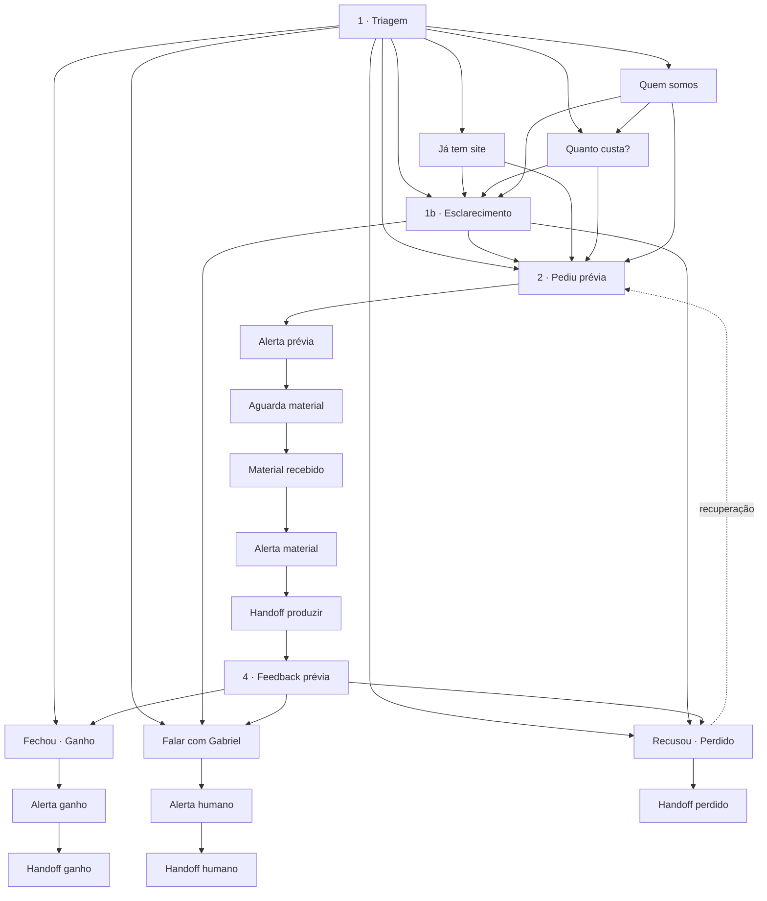

# Bot Stresser Digital — Prospecção

Atendimento automático pós-disparo de template. Preview grátis → R$ 599 se aprovar.

## Referências rápidas

| Item | Valor |
|---|---|
| flowId | `cmt2rfch7001ycxpl0d4096g1` |
| Nome | Stresser Digital — Atendimento Prospecção |
| Conexão WA (cuid) | `cmrz3oczf001oj14urgnlnu18` (Mente em foco) |
| Conexão WA (UUID Meta) | `95986816-744b-4470-9696-4b33e862eeef` |
| Pipeline CRM | `cmt2u2033004wdn0ukxj4hrqg` |
| Alertas Gabriel | `5511994194504` · template `stresser_alert_gabriel` |

## Mapa do fluxo



## Colunas CRM (automático)

| Nó do bot | Stage CRM |
|---|---|
| Triagem | Lead novo |
| Esclarecimento, Já tenho, Preço, Quem, Humano | Qualificando |
| Pediu prévia | Pediu prévia |
| Material recebido | Material recebido |
| Feedback prévia | Proposta enviada |
| Ganho | Ganho (WON) |
| Perdido | Perdido (LOST) |

## Intenções (como o lead fala)

Detalhe com exemplos reais: [`../scripts/analise-respostas-leads.md`](../scripts/analise-respostas-leads.md)

| Intenção | Exemplos | Rota |
|---|---|---|
| Aceite | `Pode enviar`, `Quero`, `Sim` | → prévia |
| Recusa | `Não, obrigada` | → perdido |
| Dúvida | domínio, Google, “como funciona” | → esclarecimento → prévia |
| Performance | `site lento`, `trava no celular`, `não aparece no Google` | → já tenho / esclarecimento |
| Feedback prévia | `gostei`, `quero mudar a foto`, `reparou na velocidade` | → ganho / humano / esclarecimento |
| Correção | `Não recusei`, `Eu quero` | perdido → prévia |
| Ruído | menu WB, horário, 1️⃣2️⃣3️⃣ | ignorado (não inicia bot) |

## Manutenção

**Fonte única de verdade (código):**

```
hermes-chat/zapflow/zapflow-backend/scripts/stresser-bot/
├── config.ts   ← textos, keywords, CRM, arestas
└── apply.ts    ← aplica no banco (idempotente)
```

**Aplicar alterações:**

```bash
# local (confirme DATABASE_URL)
cd zapflow/zapflow-backend && npx tsx scripts/patch-stresser-bot.ts

# produção
ssh hostinger-zapflow 'docker exec hermes-backend npx tsx scripts/patch-stresser-bot.ts'
```

**Layout no editor** (5 colunas em `config.ts` → `NODE_POSITIONS`):

| Coluna | Nós |
|---|---|
| Perdido (80) | Recusou, handoff |
| Entrada (400) | Já tem site |
| Hub (800) | Triagem, Esclarecimento |
| Prévia (1200) | Pediu prévia → alerta → aguarda → material → alerta → handoff → feedback |
| Info (1600) | Preço, Quem somos |
| Fechamento (2000) | Humano, Ganho (+ alertas e handoffs) |

Scripts antigos (`patch-stresser-bot-*.ts`) estão obsoletos — use só `patch-stresser-bot.ts`.

## Regras do motor (fora do grafo)

Implementadas no `zapflow-ia-service` / backend:

- Keywords com limite de palavra (evita “agora não faço mais” = recusa)
- Handoff `departamento` = nota interna, nunca WhatsApp pro lead
- Autoresposta WhatsApp Business filtrada (`whatsappBusinessAutoReply.ts`)
- Primeira resposta do lead avalia intenção antes de reenviar triagem

## Backlog

- Detectar link/mídia em `preview_wait` como material (hoje qualquer texto avança)
- Template Meta `stresser_alert_gabriel` aprovado e testado end-to-end
